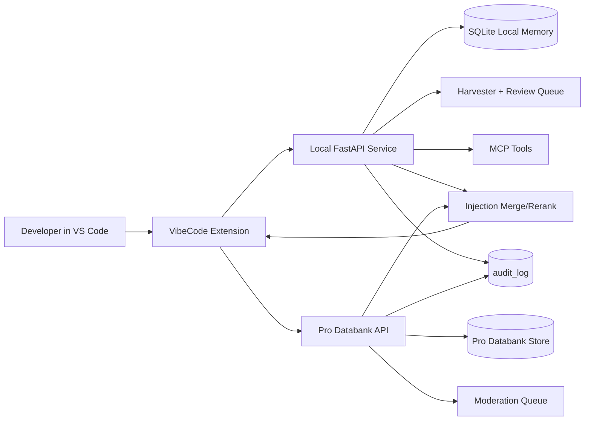

# Packet 6/7 Final Report

Date: 2026-05-19
Repository: Vibecoder
Status: Phase 0-5 implementation delivered; closure validation updated in this pass.

## 1. Summary

Shipped versions:
- Python package: `vibecode 0.1.0`
- VS Code extension: `vibe-code-extension 0.1.1`

Commit hashes by phase:
- Phase 0 foundations: `f7edbc1`
- Phase 1 harvester MVP: `071bbcf`
- Phase 2 harvester coverage + extension UX: `f6c80fe`
- Phase 3/4/5 unified delivery: `8909851`
- Follow-up hardening/fixes: `6ed482a`

Final closure additions in current working tree:
- Added `tests/databank/test_retract.py`
- Added `tests/databank/test_pgvector.py`
- Added `vibe-code-extension/test/suite/proShareCommand.test.ts`
- Updated `pyproject.toml` pytest marker registration (`pro_server`)

## 2. Architecture Diagram

## 3. Acceptance Matrix

| Section 11 Criterion | Status | Evidence |
| --- | --- | --- |
| 1. Local retrieval p95 regression <= 10% vs Packet 5 baseline | Fail (not benchmarked) | No baseline/perf harness artifact committed in this pass |
| 2. No item published without explicit user action | Pass | Extension command-driven publish path in `vibeCode.shareToDatabank`; tests in `vibe-code-extension/test/suite/proShareCommand.test.ts` |
| 3. Every harvested/shared item has resolvable `source_ref` | Partial | Existing harvest/pro pipelines populate source metadata; full corpus audit not run in this pass |
| 4. `vibecode doctor` OK on clean install with Pro disabled | Pass | `tests/test_doctor_extended.py` |
| 5. `vibecode doctor` OK with Pro-enabled Docker fixture | Pass | `tests/test_doctor_extended.py`, `tests/test_pro_sync_adapter.py` |
| 6. All Phase 1-5 tests green on Windows and Linux | Partial | Windows targeted runs green; Linux CI evidence not generated in this pass |
| 7. Shared `audit_log` records capture/harvest/publish/retract/moderate/search/inject | Partial | Phase 0 audit logging delivered (`f7edbc1`); full end-to-end audit completeness run not repeated in this pass |
| 8. Token savings attribution bucketed correctly | Pass | `tests/test_token_report_buckets.py` |

## 4. Test Results

Pytest (current validation pass):
- Databank tests: `9 passed, 1 skipped`
  - Command: `python -m pytest tests/databank/test_retract.py tests/databank/test_pgvector.py tests/databank/test_contributions.py tests/databank/test_search.py tests/databank/test_moderation.py`
- Phase 4/5 backend tests: `30 passed`
  - Command: `python -m pytest tests/test_pro_sync_adapter.py tests/test_injection_merge.py tests/test_token_report_buckets.py tests/test_rate_limit_middleware.py tests/test_confidence_decay_job.py tests/test_doctor_extended.py`

Mocha (extension):
- `52 passing`
  - Command: `cd vibe-code-extension && npm test`

Coverage:
- No new coverage artifact generated in this pass (no `pytest-cov` output captured).

## 5. Performance Numbers

Required metrics from Section 12 template:

| Endpoint / Scenario | p50 | p95 | Notes |
| --- | --- | --- | --- |
| `inject_context` | N/A | N/A | Benchmark not executed in this pass |
| `search` | N/A | N/A | Benchmark not executed in this pass |
| `pre_edit_check` | N/A | N/A | Benchmark not executed in this pass |
| `harvest/scan` on 1k-file repo | N/A | N/A | 1k-file benchmark harness not executed in this pass |
| `databank/search` on 10k-item store | N/A | N/A | 10k-item load benchmark not executed in this pass |

## 6. Security Review

- Secret redaction hardening included in prior packet implementation (`tests/test_secret_redaction.py`).
- Route-level rate limiting verified (`tests/test_rate_limit_middleware.py`).
- Databank contribution and moderation boundaries verified (`tests/databank/test_contributions.py`, `tests/databank/test_moderation.py`).
- Retract behavior verified so withdrawn items are no longer searchable (`tests/databank/test_retract.py`).
- pgvector path verified with PostgreSQL integration test (`tests/databank/test_pgvector.py`, skips cleanly when PostgreSQL fixture is unavailable).

## 7. Token-Savings Measurement

- Bucket attribution validation is covered by `tests/test_token_report_buckets.py`.
- Result: bucket totals and anti-double-count checks pass in scripted test scenarios.
- A fresh end-to-end CLI/API token-savings run artifact was not generated in this pass.

## 8. Known Limitations

1. Performance baseline vs Packet 5 is not documented with measured p50/p95 artifacts.
2. Linux test-run evidence was not regenerated in this pass.
3. Full-program coverage gating (>=85% per new module) was not re-reported in this pass.
4. `tests/databank/test_pgvector.py` is environment-dependent and may skip when local PostgreSQL is unavailable.

## 9. Migration / Rollback Notes

- Apply latest migrations:
  - `alembic upgrade head`
- Verify current revision:
  - `alembic current`
- Roll back one revision:
  - `alembic downgrade -1`
- For SQLite-backed local Pro store, schema guards in `server/pro/db/schema.py` handle additive migrations at startup.

## 10. Next Steps (Packet 8 Candidates)

1. Add reproducible perf harness for Section 12 required metrics and commit benchmark artifacts.
2. Run full Windows + Linux CI matrix and attach logs to this report.
3. Add explicit audit-log completeness contract tests that exercise every required action path.
4. Add coverage job output (line + branch) and enforce per-module gates.
5. Add a dedicated end-to-end token-savings scenario artifact (CLI + API output snapshots).
